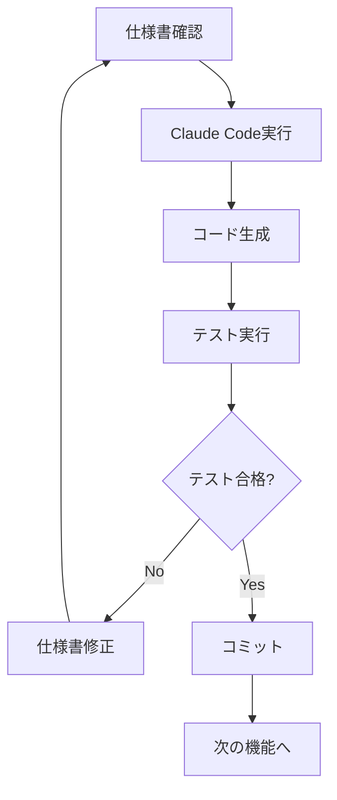

# Claude Code 実装ガイド
# Shift Scheduler システム

## 🎯 Claude Code で効果的に実装するためのガイド

### 📋 推奨仕様書構造

Claude Codeは以下の構造化された仕様書を好みます：

1. **明確な機能要件**: 機能ID付きで体系化
2. **詳細な制約仕様**: 数式・条件式での定義
3. **具体的なデータモデル**: 型注釈とメソッド仕様
4. **完全なAPI仕様**: リクエスト/レスポンス例
5. **テスト仕様**: 期待値とテストケース

### 🔧 Claude Code 実装時のベストプラクティス

#### 1. 仕様書の参照方法
```bash
# プロジェクトルートで Claude Code を実行
claude-code --spec SYSTEM_SPECIFICATION.md

# 特定機能の実装
claude-code implement "シフト固定機能 (F003)" --spec SYSTEM_SPECIFICATION.md

# 制約の実装
claude-code implement "HC001: スキルマッチング制約" --spec SYSTEM_SPECIFICATION.md
```

#### 2. 段階的実装アプローチ
```bash
# Phase 1: データモデル
claude-code implement "Employee, Shift, ShiftSchedule classes"

# Phase 2: 基本制約
claude-code implement "Hard Constraints (HC001-HC003)"

# Phase 3: API エンドポイント
claude-code implement "Basic optimization endpoints (F001-F002)"

# Phase 4: 高度な機能
claude-code implement "Shift pinning functionality (F003)"
```

#### 3. テスト駆動開発
```bash
# テスト仕様から実装
claude-code implement tests --spec SYSTEM_SPECIFICATION.md

# 特定機能のテスト
claude-code test "シフト重複防止制約" --spec SYSTEM_SPECIFICATION.md
```

### 📚 仕様書の活用例

#### 新機能追加時
```bash
# 仕様書を更新してから実装
# 1. SYSTEM_SPECIFICATION.md に新機能仕様を追加
# 2. Claude Code で実装
claude-code implement "新機能名" --spec SYSTEM_SPECIFICATION.md
```

#### バグ修正時
```bash
# 制約仕様を参照して修正
claude-code debug "制約違反エラー" --spec SYSTEM_SPECIFICATION.md
```

#### リファクタリング時
```bash
# アーキテクチャ仕様に従って改善
claude-code refactor --follow-spec SYSTEM_SPECIFICATION.md
```

### 🎯 Claude Code に最適化された仕様書の特徴

作成した `SYSTEM_SPECIFICATION.md` は以下の点でClaude Code実装に最適化されています：

1. **機能ID体系**: F001, HC001, SC001 など明確なID
2. **制約の数式化**: 数学的表現による明確な定義
3. **具体的なコード例**: Python型注釈とメソッドシグネチャ
4. **完全なAPI仕様**: リクエスト/レスポンス形式
5. **段階的実装計画**: Phase別の開発ロードマップ

### 💡 実装時の推奨フロー



### 🚀 今すぐ実装可能

この仕様書を使って、Claude Codeで以下のような実装が可能です：

```bash
# 基本実装
claude-code implement "従業員とシフトのデータモデル" --spec SYSTEM_SPECIFICATION.md

# 制約実装
claude-code implement "スキルマッチング制約 (HC001)" --spec SYSTEM_SPECIFICATION.md

# API実装
claude-code implement "シフト最適化API (F001)" --spec SYSTEM_SPECIFICATION.md

# テスト実装
claude-code implement "制約テストケース" --spec SYSTEM_SPECIFICATION.md
```

この仕様書により、Claude Codeでより効率的で正確な実装が可能になります！