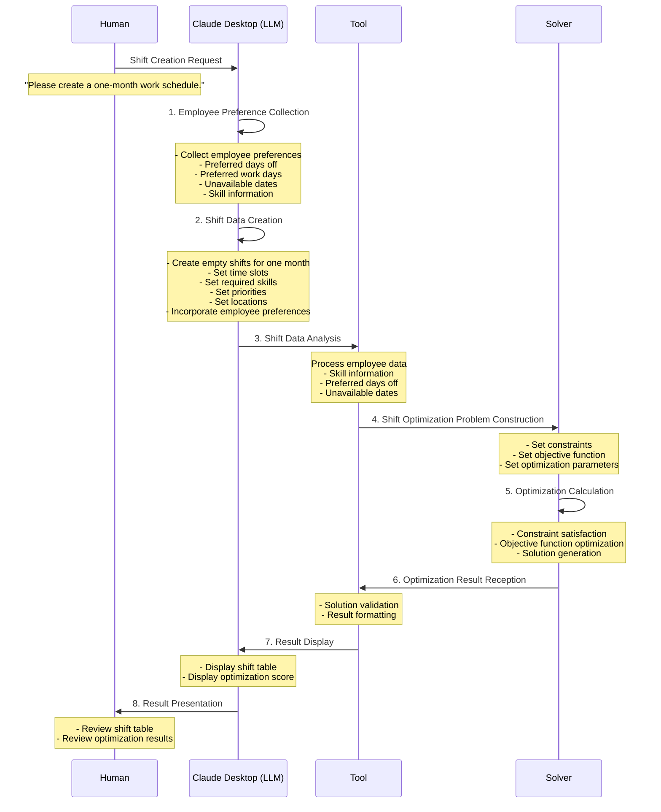

# Natural Shift Planner

A Shift Scheduler API using Timefold Solver with FastMCP integration for AI assistant support.

## 🚀 Quick Start

### Prerequisites

```bash
# Docker Desktop
brew install --cask docker

# VS Code + Dev Containers extension
brew install --cask visual-studio-code
code --install-extension ms-vscode-remote.remote-containers
```

### Starting Development Environment

**Method 1: VS Code Dev Container (Recommended)**
```bash
# Open project
code /projects/shared/shift-scheduler

# Command Palette (Cmd+Shift+P) → "Dev Containers: Reopen in Container"
```

**Method 2: Setup Script**
```bash
cd /projects/shared/shift-scheduler

# Docker environment setup
chmod +x setup-docker.sh
./setup-docker.sh

# Start Dev Container
make dev-setup
```

### Development Start

Inside Dev Container:
```bash
# Install dependencies
make setup

# Install Node.js dependencies with Bun (for Husky)
bun install

# Start application
make run  # → http://localhost:8081

# Start with extended solver timeout and verbose logging
SOLVER_TIMEOUT_SECONDS=300 SOLVER_LOG_LEVEL=DEBUG make run

# Run tests
make test

# Check API specification
# → http://localhost:8081/docs (Swagger UI)
```

## 🐳 Docker Deployment

The project includes Docker Compose configurations for both development and production environments.

### Development with Docker Compose

```bash
# Copy environment variables template
cp .env.example .env

# Start development environment (API + PostgreSQL)
docker-compose up

# Start with MCP server included
docker-compose --profile mcp up

# Start in background
docker-compose up -d
```

**Features:**
- Hot reload with source code volume mounts
- PostgreSQL database for future use
- Persistent job storage
- Development-optimized settings

### Production Deployment

```bash
# Use production configuration
docker-compose -f docker-compose.prod.yml up -d

# Full production stack with reverse proxy and cache
docker-compose -f docker-compose.prod.yml --profile nginx --profile cache up -d
```

**Features:**
- Optimized container settings
- Nginx reverse proxy
- Resource limits and health checks
- Redis cache (optional)
- Production-grade logging

### Environment Variables

All configuration is managed through environment variables. See `.env.example` for a complete list.

**Key Variables:**

| Variable | Default | Description |
|----------|---------|-------------|
| `LOG_LEVEL` | `INFO` | Application logging level |
| `SOLVER_TIMEOUT_SECONDS` | `120` | Solver optimization timeout |
| `SHIFT_SCHEDULER_PORT` | `8081` | API server port |
| `POSTGRES_PASSWORD` | - | Database password (required in production) |
| `JAVA_OPTS` | `-Xmx1g` | JVM memory and optimization settings |

**Development Example:**
```bash
# .env file for development
LOG_LEVEL=DEBUG
SOLVER_TIMEOUT_SECONDS=60
JAVA_OPTS=-Xmx512m
```

**Production Example:**
```bash
# .env file for production
LOG_LEVEL=WARN
SOLVER_TIMEOUT_SECONDS=300
JAVA_OPTS=-Xmx2g -XX:+UseG1GC
POSTGRES_PASSWORD=secure_password_here
```

### Service Profiles

Use Docker Compose profiles to control which services are started:

```bash
# Default: API + Database
docker-compose up

# Include MCP server
docker-compose --profile mcp up

# Production with reverse proxy
docker-compose -f docker-compose.prod.yml --profile nginx up

# Full stack with cache
docker-compose -f docker-compose.prod.yml --profile nginx --profile cache up
```

### Health Checks and Monitoring

All services include health checks:
- **API**: `GET /health` endpoint
- **PostgreSQL**: `pg_isready` command
- **Redis**: `redis-cli ping` command
- **Nginx**: Process and port monitoring

Access points:
- **API**: http://localhost:8081
- **API Documentation**: http://localhost:8081/docs
- **MCP Server**: http://localhost:8082 (if enabled)
- **Web Interface**: http://localhost (if nginx profile enabled)

## 📁 Project Structure

```
shift-scheduler/
├── .devcontainer/          # Dev Container configuration
│   ├── devcontainer.json   # VS Code Dev Container settings
│   ├── docker-compose.yml  # Dev Container Docker Compose
│   └── Dockerfile          # Dev Container Dockerfile
├── .vscode/                # VS Code settings
│   ├── settings.json       # Editor settings
│   ├── launch.json         # Debug settings
│   └── extensions.json     # Recommended extensions
├── src/                    # Source code directory
│   └── natural_shift_planner/
│       ├── api/            # FastAPI application
│       │   ├── app.py      # FastAPI instance
│       │   ├── routes.py   # API endpoints
│       │   ├── schemas.py  # Pydantic models
│       │   ├── solver.py   # Timefold solver config
│       │   ├── jobs.py     # Async job management
│       │   ├── converters.py # Schema converters
│       │   └── analysis.py # Weekly hours analysis
│       ├── core/           # Domain logic
│       │   ├── models/     # Domain models
│       │   │   ├── employee.py
│       │   │   ├── shift.py
│       │   │   └── schedule.py
│       │   └── constraints/# Optimization constraints
│       │       └── shift_constraints.py
│       ├── mcp/            # MCP server implementation
│       │   ├── server.py   # FastMCP server
│       │   └── tools.py    # MCP tool functions
│       └── utils/          # Utilities
│           └── demo_data.py
├── tests/                  # Test files
│   ├── test_models.py
│   └── test_mcp.py
├── main.py                 # API entry point
├── mcp_server.py           # MCP server entry point
├── api-test.http           # REST Client API tests
├── MCP_SERVER.md           # MCP server documentation
├── CLAUDE.md               # Claude Code guidance
├── Dockerfile              # Production Dockerfile (multi-platform)
├── docker-compose.yml      # Production Docker Compose
├── pyproject.toml          # uv configuration
├── Makefile                # Development efficiency commands
└── README.md               # This file
```

## 🎯 Key Features

### ✅ **Shift Optimization**
- **Skill-based Assignment**: Matching required skills with employee skills
- **Time Constraint Management**: Shift overlap prevention, minimum break time
- **Weekly Work Hours Constraints**: 40-hour limit, minimum work hours, target time adjustment
- **Fairness Optimization**: Equal distribution of work hours

### 👥 **Employee Management** (NEW!)
- **Add Employees to Completed Jobs**: Add new employees to already solved schedules
- **Skill Updates**: Update employee skills and re-optimize affected assignments
- **Minimal Re-optimization**: Uses intelligent pinning to preserve valid assignments
- **Constraint Resolution**: Automatically resolves violations while minimizing changes

### 🔧 **Continuous Planning** (Coming Soon)
- **Real-time Modifications**: Modify schedules during optimization without full re-solving
- **Shift Swapping**: Exchange employees between shifts using ProblemChangeDirector
- **Emergency Replacements**: Find suitable replacements when employees become unavailable
- **Shift Pinning**: Lock specific shifts to prevent changes during optimization
- **Live Reassignment**: Reassign shifts to specific employees or unassign them

### 📄 **Report Generation**
- **HTML Reports**: Formatted web-based schedule reports with statistics and styling
- **Visual Display**: Clear visual representation of shift schedules
- **Downloadable Files**: Automatic filename generation with timestamps

### 🤖 **MCP Server Integration**
- **AI Assistant Support**: Built-in MCP (Model Context Protocol) server for Claude Desktop and other AI assistants
- **Python-based Implementation**: Uses FastMCP for seamless integration
- **Full API Access**: All shift scheduling and continuous planning features available through MCP tools

### ⚙️ **Configurable Solver** (NEW!)
- **Extended Timeout**: Configure solver runtime via `SOLVER_TIMEOUT_SECONDS` (default: 120s)
- **Verbose Logging**: Real-time optimization progress with `SOLVER_LOG_LEVEL=DEBUG`
- **Progress Tracking**: Monitor score improvements and constraint violations
- **Better Solutions**: Longer solving time for more optimal shift assignments

## 📊 API Specification

### Core Endpoints

```http
GET  /health                          # Health check
GET  /api/shifts/demo                 # Demo data
POST /api/shifts/solve-sync           # Synchronous shift optimization
POST /api/shifts/solve                # Asynchronous shift optimization
GET  /api/shifts/solve/{job_id}       # Get optimization results
POST /api/shifts/analyze-weekly       # Weekly work hours analysis (immediate)
GET  /api/shifts/weekly-analysis/{job_id} # Weekly work hours analysis (after solve)
GET  /api/shifts/test-weekly          # Weekly work hours constraint test (demo)
```

### Employee Management Endpoints (NEW!)

```http
POST /api/shifts/{job_id}/add-employee        # Add employee to completed job
PATCH /api/shifts/{job_id}/employee/{employee_id}/skills  # Update employee skills
```

### Continuous Planning Endpoints (Coming Soon)

```http
POST /api/shifts/{job_id}/swap               # Swap employees between two shifts
POST /api/shifts/{job_id}/replace            # Find replacement for unavailable employee
POST /api/shifts/{job_id}/pin                # Pin/unpin shifts for continuous planning
POST /api/shifts/{job_id}/reassign           # Reassign shift to specific employee
```

### Job Management Endpoints (NEW!)

```http
GET  /api/jobs                               # List all jobs
DELETE /api/jobs/{job_id}                    # Delete specific job
POST /api/jobs/cleanup                       # Clean up old jobs
```

### Report Generation Endpoints

```http
# HTML Reports
GET  /api/shifts/demo/html                   # Demo schedule as HTML report
GET  /api/shifts/solve/{job_id}/html         # Optimization result as HTML report
POST /api/shifts/solve-sync/html             # Synchronous solve with HTML report

```

### Request Example

```json
{
  "employees": [
    {
      "id": "emp1",
      "name": "John Doe",
      "skills": ["Nurse", "CPR", "Full-time"]
    }
  ],
  "shifts": [
    {
      "id": "morning_shift",
      "start_time": "2025-06-01T08:00:00",
      "end_time": "2025-06-01T16:00:00",
      "required_skills": ["Nurse"],
      "location": "Hospital",
      "priority": 1
    }
  ]
}
```

## 🔧 Constraint System

| Level | Constraint | Description |
|--------|--------|------|
| **HARD** | Skill Matching | Only assign employees with required skills |
| **HARD** | Shift Overlap Prevention | Prevent same employee in overlapping shifts |
| **HARD** | Weekly Max Hours | Violation if over 45 hours |
| **MEDIUM** | Minimum Break Time | 8 hours break between consecutive shifts |
| **MEDIUM** | Weekly Min Hours | Full-time minimum 32 hours |
| **SOFT** | Work Hours Fair Distribution | Minimize work hours gap between employees |
| **SOFT** | Weekly Target Hours | Approximate to personal target hours |

## 🤖 MCP Server for AI Assistants

This project includes a built-in MCP (Model Context Protocol) server that allows AI assistants like Claude Desktop to interact with the Shift Scheduler API.

### Quick Start with MCP

```bash
# Run both API and MCP servers together
make run-mcp

# Or run them separately:
make run      # Terminal 1: API server
make mcp      # Terminal 2: MCP server
```

### Available MCP Tools

#### Core Operations
- `health_check` - Check API health status
- `get_demo_schedule` - Retrieve demo shift schedule with sample data
- `solve_schedule_sync` - Solve shift scheduling synchronously
- `solve_schedule_async` - Start async optimization (returns job ID)
- `get_solve_status` - Check async job status
- `analyze_weekly_hours` - Analyze weekly work hours for schedules
- `test_weekly_constraints` - Test weekly hour constraints with demo data

#### Schedule Management  
- `get_schedule_shifts` - Inspect completed schedules in detail

#### Continuous Planning (Real-time Modifications)
- `swap_shifts` - Swap employees between two shifts during optimization
- `find_shift_replacement` - Find replacement when employee becomes unavailable
- `pin_shifts` - Pin/unpin shifts to prevent changes during optimization
- `reassign_shift` - Reassign shift to specific employee or unassign

#### Report Generation
- `get_demo_schedule_html` - Get demo schedule as HTML report
- `get_schedule_html_report` - Get completed schedule as HTML report  
- `solve_schedule_sync_html` - Solve and return HTML report in one step

### Claude Desktop Configuration

Add to your Claude Desktop config file:
- **macOS**: `~/Library/Application Support/Claude/claude_desktop_config.json`
- **Windows**: `%APPDATA%\Claude\claude_desktop_config.json`

```json
{
  "mcpServers": {
    "shift-scheduler": {
      "command": "uv",
      "args": ["run", "--project", "/path/to/shift-scheduler", "python", "/path/to/shift-scheduler/mcp_server.py"],
      "env": {
        "SHIFT_SCHEDULER_API_URL": "http://localhost:8081"
      }
    }
  }
}
```

See [MCP_SERVER.md](MCP_SERVER.md) for detailed setup and usage instructions.

## 🧪 Testing & Debugging

### VS Code Integrated Testing
```bash
# Run in Test Explorer
# Command Palette → "Test: Run All Tests"

# Debug Execution
# F5 key → Start debugging with "FastAPI Server" configuration
```

### REST Client Testing
```bash
# Open api-test.http file and
# Click "Send Request" above API requests
```

### Command Line Testing
```bash
make test-api      # Verify API functionality
make test-solve    # Test shift optimization
make test          # Full test suite
```

## 🛠 Troubleshooting

### Common Issues and Solutions

#### 1. **uv sync Error**
```bash
# Issue: Corrupted uv.lock file
# Solution:
rm -f uv.lock
uv sync --no-install-project
```

#### 2. **Java Environment Error**
```bash
# Check Java environment
java -version
echo $JAVA_HOME

# Expected values: 
# OpenJDK 17
# JAVA_HOME=/usr/lib/jvm/java-17-openjdk
```

#### 3. **Python Version Error (Timefold)**
```bash
# Issue: Timefold doesn't support Python 3.13+
# Solution: Use Python 3.11 or 3.12
rm -rf .venv
uv venv --python 3.11
make setup
```

#### 4. **Browser Access Issues**
```bash
# Check VS Code PORTS tab
# Click 🌐 icon for localhost:8081
# Or right-click → "Open in Browser"
```

#### 5. **bash history Error**
```bash
# Solution:
mkdir -p /home/vscode/commandhistory
touch /home/vscode/commandhistory/.bash_history

# Or rebuild Dev Container completely
# Command Palette → "Dev Containers: Rebuild Container"
```

### Environment Check Commands

```bash
# Overall check
make check

# Individual checks
python --version    # Python 3.11.x
uv --version       # uv 0.7.x
java -version      # OpenJDK 17
echo $JAVA_HOME    # Java environment variable

# Application verification
curl http://localhost:8081/health
curl http://localhost:8081/api/shifts/demo
```

### Complete Reset Procedure

Last resort if issues persist:

```bash
# 1. Clean up Docker environment
docker system prune -a

# 2. Rebuild Dev Container completely
# VS Code Command Palette:
# "Dev Containers: Rebuild Container"

# 3. Manual verification
cd /workspace
make setup
make run
```

## 💡 Best Practices

### **Code Quality & Git Hooks**
- Auto-format on save (ruff)
- Linting (ruff, mypy)
- Type hints recommended
- **Husky pre-commit hooks** automatically ensure code quality

#### Git Hooks (Husky)
This project uses Husky to automatically run quality checks before commits:

```bash
# Pre-commit hooks run automatically:
# ✅ Code formatting (ruff format)
# ✅ Linting (ruff check --fix)  
# ✅ Type checking (mypy - warnings only)
# ✅ Auto-stage formatted files

# Pre-push hooks run automatically:
# ✅ Full test suite execution

# Commit message validation:
# ✅ Conventional commit format required
```

#### Available bun Scripts
```bash
# Manual code quality checks
bun run lint          # Run ruff linting
bun run lint:fix      # Run ruff linting with auto-fix
bun run format        # Run ruff formatting
bun run type-check    # Run mypy type checking
bun run test          # Run pytest test suite
```

#### Bypassing Hooks (Emergency Use)
```bash
# Skip pre-commit hooks
git commit --no-verify -m "emergency fix"

# Skip pre-push hooks  
git push --no-verify

# Skip tests during push
SKIP_TESTS=true git push
```

#### Conventional Commit Format
```bash
# Required format: type: description
feat: add new feature
fix: fix a bug  
docs: update documentation
style: code style changes
refactor: code refactoring
test: add or update tests
chore: maintenance tasks
```

### **Testing**
```bash
# Unit tests
make test

# Check coverage
uv run pytest --cov=.
```

### **Performance**
- Docker Desktop recommended settings: CPU 4+ cores, Memory 8GB+
- File sync optimized

## 📚 References

- [Timefold Solver Documentation](https://docs.timefold.ai/)
- [FastAPI Documentation](https://fastapi.tiangolo.com/)
- [uv Documentation](https://github.com/astral-sh/uv)
- [Dev Containers Documentation](https://code.visualstudio.com/docs/devcontainers/containers)

## ✅ Success Checklist

- [ ] Dev Container started successfully
- [ ] Server started with `make run`
- [ ] Browser access to http://localhost:8081
- [ ] `/health` endpoint verified
- [ ] `/api/shifts/demo` data retrieved
- [ ] Debug and test execution in VS Code working

## 🤝 Support

If issues persist, please provide:
- OS version
- Docker Desktop version
- VS Code version
- Specific error messages
- `make check` results

---

**🎉 Happy Coding with Shift Scheduler!**

## Development Environment

All development for this project must be done inside the VS Code Dev Container. Direct local development is not supported.

### Setup Instructions
1. Install Visual Studio Code
2. Install the Remote - Containers extension
3. Open this repository in VS Code and select "Remote-Containers: Open Folder in Container..."

## Shift Creation Flow

The following diagram explains the flow of shift creation.



### Step-by-Step Explanation

1. **Employee Preference Collection (LLM)**
   - Gather employee information
     - Preferred days off
     - Preferred work days
     - Unavailable dates
     - Skill information
     - Employment type preferences

2. **Shift Data Creation (LLM)**
   - Create empty shifts for one month
     - Weekday shifts (Mon-Fri)
     - Weekend shifts
   - Configure each shift
     - Time slots (Morning, Afternoon)
     - Required skills
     - Priority levels
     - Locations
   - Special shift settings
     - Saturday special shifts, etc.
   - Incorporate employee preferences
     - Match skills with required positions
     - Consider preferred work days
     - Avoid unavailable dates

3. **Shift Data Analysis (Tool)**
   - Create employee data
     - Skill information
     - Preferred days off
     - Unavailable dates
     - Employment type

4. **Shift Optimization Problem Construction (Solver)**
   - Set hard constraints
     - Skill requirements
     - Unavailable dates
   - Set soft constraints
     - Preferred days off
     - Preferred work days

5. **Optimization Calculation (Solver)**
   - Solve constraint satisfaction problem
   - Optimize objective function
   - Generate and evaluate solutions

6. **Optimization Result Reception (Tool)**
   - Validate generated solutions
   - Format and structure results

7. **Result Display (LLM)**
   - Display shift table in tabular format
   - Display optimization score
   - Display constraint satisfaction status

8. **Result Presentation (Human)**
   - Review shift table in tabular format
   - Review optimization results explanation
