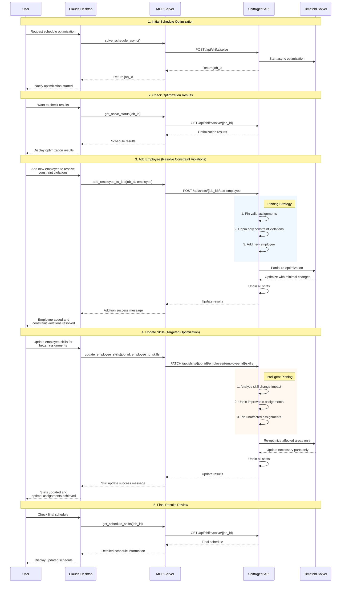
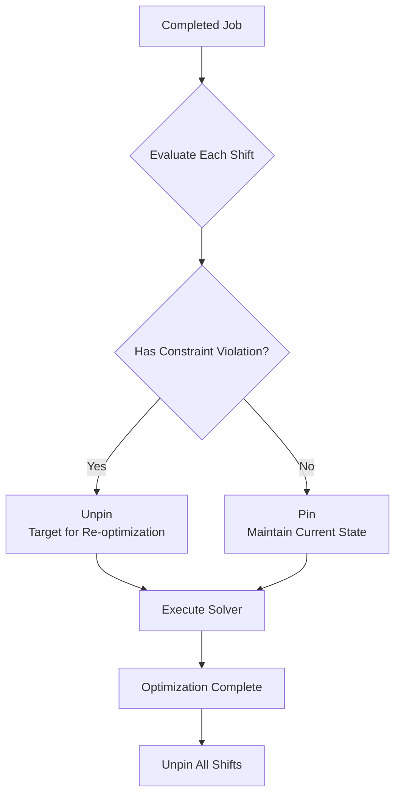
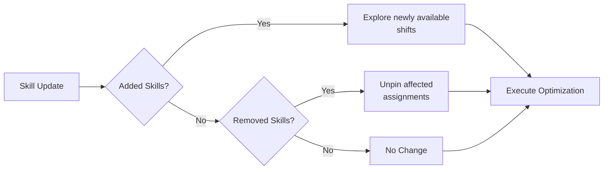

# MCP Employee Management Sequence Diagram

Sequence diagram for employee management functionality accessed from Claude Desktop.

## Key Processing Flows

### 1. Pinning Strategy Details

### 2. Impact Analysis for Skill Updates

## Technical Highlights

1. **Asynchronous Processing**: Initial optimization runs async due to processing time
2. **Pinning Feature**: Leverages Timefold Solver's `@PlanningPin` annotation
3. **Minimal Changes**: Preserves existing valid assignments, re-optimizes only necessary parts
4. **MCP Integration**: Claude Desktop communicates with API through MCP tools

## Error Handling

- Job not found: 404 error
- Job not completed: 400 error
- Employee not found: 404 error
- Optimization failure: 500 error

## Architecture Benefits

### Intelligent Re-optimization
- **Employee Addition**: Focuses on unassigned shifts and constraint violation resolution
- **Skill Updates**: Recalculates only assignments affected by skill changes
- **Partial Optimization**: Processes only parts that need changes, not the entire schedule

### User Experience
- **Natural Language Interface**: Users can describe their needs in plain language
- **Real-time Feedback**: Immediate status updates and detailed results
- **Minimal Disruption**: Existing schedule remains stable while making targeted improvements

### Technical Excellence
- **Constraint Preservation**: Hard constraints always maintained
- **Performance Optimization**: Pinning reduces solver complexity
- **Scalability**: Partial re-optimization scales better than full recalculation
