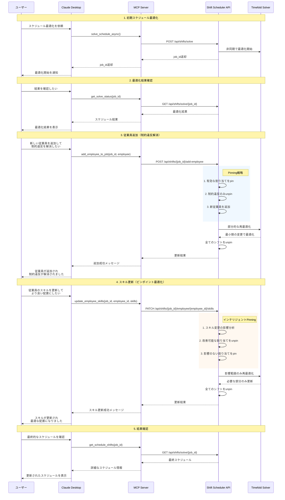
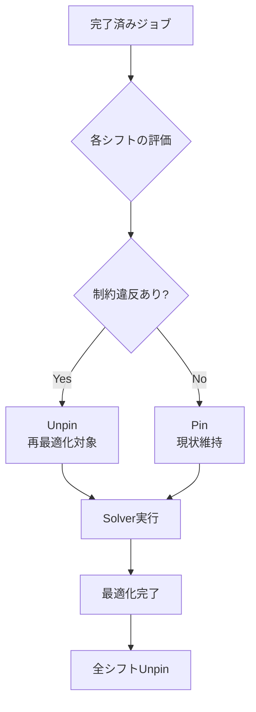
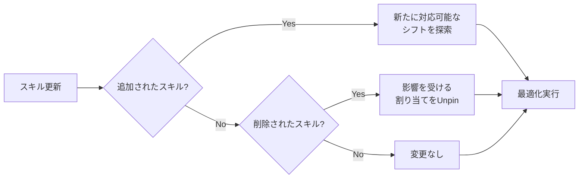

# MCP Employee Management Sequence Diagram

Claude Desktopから従業員管理機能を利用する際のシーケンス図です。

## 主要な処理フロー

### 1. Pinning戦略の詳細

### 2. スキル更新時の影響分析

## 技術的なポイント

1. **非同期処理**: 初期の最適化は時間がかかるため非同期で実行
2. **Pinning機能**: Timefold Solverの`@PlanningPin`アノテーションを活用
3. **最小限の変更**: 既存の有効な割り当ては保持し、必要な部分のみ再最適化
4. **MCP統合**: Claude DesktopがMCPツールを通じてAPIと通信

## エラーハンドリング

- ジョブが見つからない場合: 404エラー
- ジョブが完了していない場合: 400エラー
- 従業員が見つからない場合: 404エラー
- 最適化に失敗した場合: 500エラー
